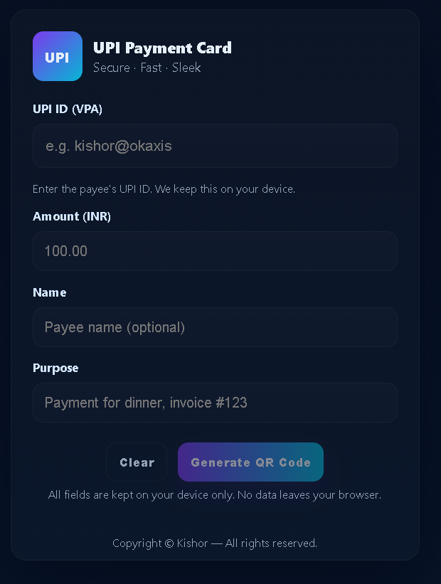

# QR-Code-Generator
A sleek, interactive UPI Card QR Generator that will let users instantly create UPI payment QR codes in a fully secure manner. Premium design with smooth flip animation, 3D tilt effects, and local processing for full privacy; it offers fast, easy sharing and downloading for seamless digital payments.

UPI Card QR Generator

A sleek, modern, and interactive UPI QR generator featuring a premium UI, smooth flip animations, and 3D tilt effects. This tool allows users to create secure UPI payment QR codes instantly — all processing happens locally inside the browser for complete privacy.

📸 Screenshots
<h3> Front Screenshot</h3>

<h3> Back Screenshot</h3>

🚀 Features

🔹 Clean single-column input form

🔹 Real-time UPI QR generation

🔹 Smooth card flip animation

🔹 3D pointer-based tilt movement

🔹 Download & Share QR functionality

🔹 Fully client-side with zero data collection

🔹 Modern glass-effect premium UI

🧩 How It Works

Enter your UPI ID, Amount, Payee Name, and Purpose

Click Generate QR Code

The card flips to show the QR instantly

Use Download or Share to send the QR

The payer scans the QR using any UPI app (GPay, PhonePe, Paytm, BHIM, etc.)

🛠️ Tech Stack

HTML5

CSS3 (Glass UI, animations, transitions)

Vanilla JavaScript

QRCode.js for QR rendering

🔐 Privacy

All data remains fully on your device.
No servers, no logs, no tracking — completely local and secure.

👨‍💻 Author

Kishor
Copyright © Kishor — All rights reserved.
